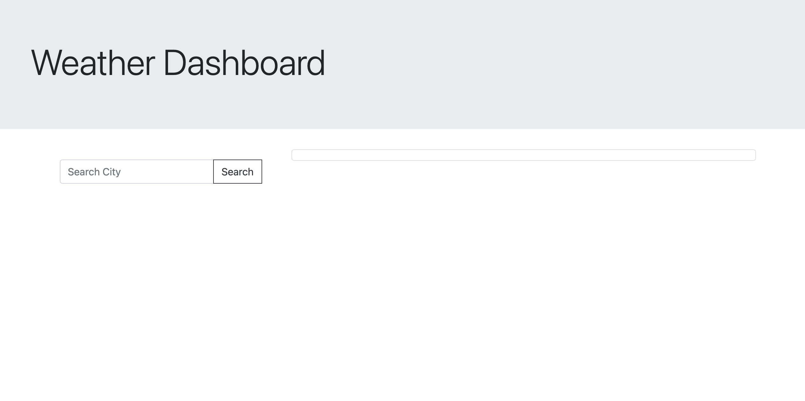
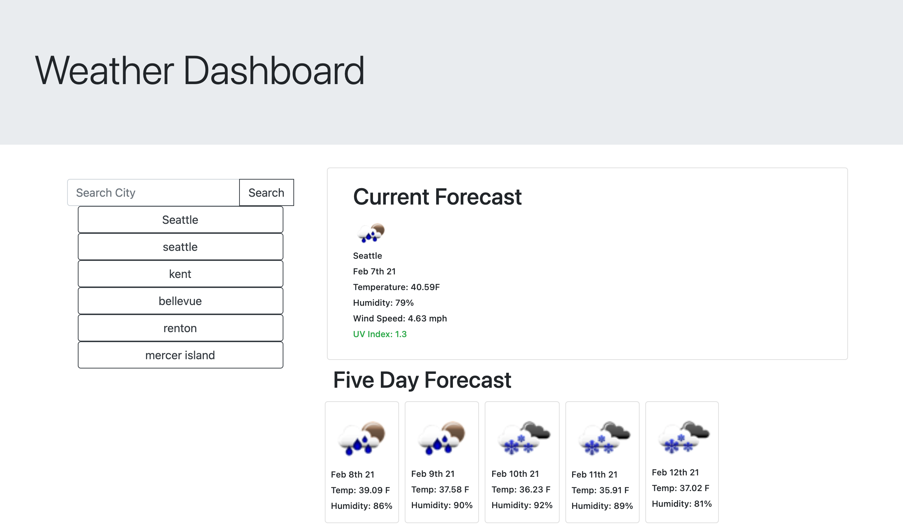

# Weather-Dashboard

## Table of Contents

* [Description](#Description)
* [Technologies Used](#TechnologiesUsed)
* [Images](#Images)
* [Links](#Links)

# Description

This is a simple weather application using the Open Weather API to get the current and five day weather forecast. Your search history is saved in local storage and you are able to access your previously searched cities by clicking on the buttons in the search history list. 

# Technologies Used

* JQuery
* Bootstrap
* JavaScript
* Open Weather API
* AJAX

# Images
 
 This image shows the opening page before entering a search. 

This image displays the application after searching for a city.

# Links

Git Hub Repo

 https://github.com/vdecyatnik/Weather-Dashboard 

Deployed Application

https://vdecyatnik.github.io/Weather-Dashboard/